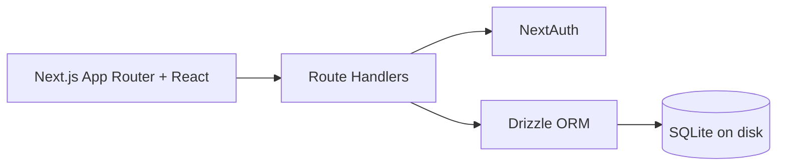

<p align="center">
  
</p>

<p align="center"><strong>A polished local-first workspace for tasks, projects, notes, and daily planning.</strong></p>

<p align="center">
  
  
  
  
  
</p>

<p align="center">
  <a href="#quick-start">Quick Start</a> •
  <a href="#local-development-prerequisites">Local Dev</a> •
  <a href="#feature-tour">Feature Tour</a> •
  <a href="#tech-stack">Tech Stack</a>
</p>

---

<p align="center">
  
</p>

<p align="center"><em>Clean dark UI, fast keyboard flow, project rollups, deadline focus, and daily dispatch planning in one screen.</em></p>

## Why It Feels Great

| | |
| --- | --- |
| **Local-first by default** | Your data stays on your machine in SQLite (`dispatch.db`). |
| **One workspace for everything** | Tasks, projects, notes, and dispatches stay connected. |
| **Keyboard-friendly UX** | Fast actions, global search, and shortcut support keep flow uninterrupted. |
| **Built for real execution** | Deadline focus, progress rollups, and upcoming work are always visible. |

## Feature Tour

- `Dashboard`: instant visibility into active tasks, notes, dispatches, deadlines, and project activity.
- `Tasks`: status + priority + due dates + project links.
- `Projects`: progress rollups and scoped task lists.
- `Notes`: markdown editing, preview, and export.
- `Dispatch`: daily planning surface with rollover support.
- `Search`: global search across tasks, notes, and dispatch records.
- `Recycle Bin`: restore or permanently remove archived items.
- `Auth`: GitHub OAuth and local development credentials.

## Architecture



## Quick Start

### Docker Setup (Recommended)

Dispatch includes production launchers that create/update `.env.prod` and run Docker Compose.

Prerequisites:

- Docker Desktop (Windows/macOS) or Docker Engine + Compose plugin (Linux)
- `docker` available on your `PATH`, with Docker running before setup
- Internet access to pull the default image (`ghcr.io/nkasco/dispatchtodoapp:latest`)

Use one of the following:

```powershell
.\dispatch.ps1 setup
```

```bash
./dispatch.sh setup
```

GitHub Auth in Docker:

- During setup, choose `Enable GitHub OAuth sign-in?` and provide `AUTH_GITHUB_ID` / `AUTH_GITHUB_SECRET`.
- Set `NEXTAUTH_URL` to the public URL users will open in the browser.
- If this runs on a dedicated server in your home/lab network, use the server hostname or LAN IP in `NEXTAUTH_URL` instead of `localhost`.
- In GitHub OAuth app settings, set the callback URL to:
  - `<NEXTAUTH_URL>/api/auth/callback/github`
  - Example: `http://dispatch-server:3000/api/auth/callback/github`

## Local Development - Prerequisites

Use this section only if you are running Dispatch locally with Node.js (`npm run dev`, `npm run build`, `npm run start`).

- [Node.js](https://nodejs.org/) `20.9+` (LTS recommended).  
  Node includes [npm](https://www.npmjs.com/), which is required for local development commands.
- [Git](https://git-scm.com/downloads) (recommended for pulling updates).
- If native module install fails (for `better-sqlite3`), install platform build tools:
  - Windows: [Visual Studio Build Tools (C++ workload)](https://visualstudio.microsoft.com/visual-cpp-build-tools/)
  - macOS: Xcode Command Line Tools (`xcode-select --install`)

### Manual Setup (Alternative)

### 1. Install

```bash
npm install
```

### 2. Configure env

Create `.env.local` (local Node.js/dev runtime only):

> Docker setup uses `.env.prod`, not `.env.local`.

```bash
# Required for NextAuth
AUTH_SECRET=your_random_secret
NEXTAUTH_URL=http://localhost:3000

# GitHub OAuth (optional)
AUTH_GITHUB_ID=your_github_oauth_client_id
AUTH_GITHUB_SECRET=your_github_oauth_client_secret

# Optional (defaults to ./dispatch.db)
DATABASE_URL=./dispatch.db
```

### 3. Migrate database

```bash
npm run db:migrate
```

### 4. Run app

```bash
npm run dev
```

Open `http://localhost:3000`.

### Dev Login (Optional)

- Seeded account: `test@dispatch.local` / `test`
  - Run `npm run db:seed` first to create the seeded account.

---

<p align="center">
  
</p>
