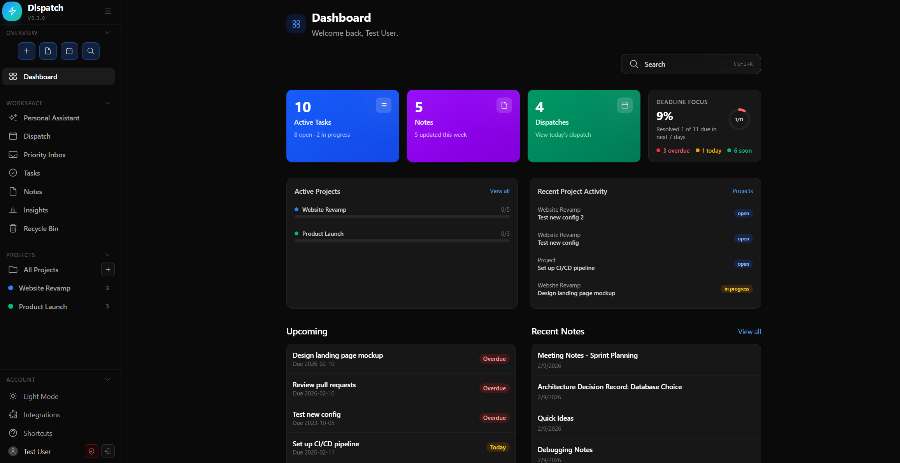
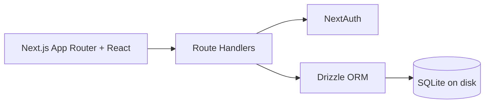

<p align="center">
  
</p>

<p align="center"><strong>A polished local-first workspace for tasks, projects, notes, and daily planning.</strong></p>

<p align="center">
  
  
  
  
  
</p>

<p align="center">
  <a href="#prerequisites">Prerequisites</a> •
  <a href="#quick-start">Quick Start</a> •
  <a href="#interactive-setup-recommended">Interactive Setup</a> •
  <a href="#feature-tour">Feature Tour</a> •
  <a href="#tech-stack">Tech Stack</a> •
  <a href="#scripts">Scripts</a>
</p>

---

## Sneak Peek

<p align="center">
  
</p>

<p align="center"><em>Clean dark UI, fast keyboard flow, project rollups, deadline focus, and daily dispatch planning in one screen.</em></p>

## Why It Feels Great

| | |
| --- | --- |
| **Local-first by default** | Your data stays on your machine in SQLite (`dispatch.db`). |
| **One workspace for everything** | Tasks, projects, notes, and dispatches stay connected. |
| **Keyboard-friendly UX** | Fast actions, global search, and shortcut support keep flow uninterrupted. |
| **Built for real execution** | Deadline focus, progress rollups, and upcoming work are always visible. |

## Feature Tour

- `Dashboard`: instant visibility into active tasks, notes, dispatches, deadlines, and project activity.
- `Tasks`: status + priority + due dates + project links.
- `Projects`: progress rollups and scoped task lists.
- `Notes`: markdown editing, preview, and export.
- `Dispatch`: daily planning surface with rollover support.
- `Search`: global search across tasks, notes, and dispatch records.
- `Recycle Bin`: restore or permanently remove archived items.
- `Auth`: GitHub OAuth and local development credentials.

## Architecture



## Prerequisites

- [Node.js](https://nodejs.org/) `20.9+` (LTS recommended).  
  Node includes [npm](https://www.npmjs.com/), which is required for `npm install`, `npm run dev`, and `npm run build`.
- [Git](https://git-scm.com/downloads) (required if you use the `update` launcher command or want to pull latest changes).
- Shell support for launcher scripts:
  - Windows: [PowerShell](https://learn.microsoft.com/powershell/) for `dispatch.ps1` (built into modern Windows).
  - macOS/Linux: Bash for `dispatch.sh`.
- If native module install fails (for `better-sqlite3`), install platform build tools:
  - Windows: [Visual Studio Build Tools (C++ workload)](https://visualstudio.microsoft.com/visual-cpp-build-tools/)
  - macOS: Xcode Command Line Tools (`xcode-select --install`)

## Quick Start

### Interactive Setup (Recommended)

Dispatch includes an interactive setup wizard that creates `.env.local`, initializes the database schema, and can optionally create your first user + seed demo data.

Use one of the following:

```powershell
npm run setup
```

```powershell
.\dispatch.ps1 setup
```

```bash
./dispatch.sh setup
```

If `.env.local` already exists, the setup wizard asks before overwriting anything.

### Manual Setup (Alternative)

### 1. Install

```bash
npm install
```

### 2. Configure env

Create `.env.local`:

```bash
# Required for NextAuth
AUTH_SECRET=your_random_secret
NEXTAUTH_URL=http://localhost:3000

# GitHub OAuth (optional)
AUTH_GITHUB_ID=your_github_oauth_client_id
AUTH_GITHUB_SECRET=your_github_oauth_client_secret

# Optional (defaults to ./dispatch.db)
DATABASE_URL=./dispatch.db
```

### 3. Migrate database

```bash
npm run db:migrate
```

### 4. Run app

```bash
npm run dev
```

Open `http://localhost:3000`.

### Dev Login (Optional)

- Seeded account: `test@dispatch.local` / `test`
- Or create a local account from the login page

## Tech Stack

- Next.js App Router
- React 19 + TypeScript
- NextAuth v5
- Drizzle ORM + better-sqlite3
- Tailwind CSS v4
- Vitest

## Scripts

- `npm run setup` - Launch interactive setup wizard (`scripts/setup.ts`)
- `npm run dev` - Start dev server
- `npm run build` - Build production bundle
- `npm run start` - Start production server
- `npm run lint` - Run lint checks
- `npm run db:generate` - Generate Drizzle migrations
- `npm run db:migrate` - Apply migrations
- `npm run db:push` - Push schema directly
- `npm run db:studio` - Open Drizzle Studio
- `npm run db:seed` - Seed sample data
- `npm test` - Run test suite

## Launcher Scripts

- `.\dispatch.ps1 <command>` (Windows PowerShell)
- `./dispatch.sh <command>` (Bash)
- Shared commands: `setup`, `dev`, `start`, `build`, `update`, `seed`, `studio`, `test`, `lint`, `version`, `help`

Example:

```powershell
.\dispatch.ps1 help
.\dispatch.ps1 setup
```

```bash
./dispatch.sh help
./dispatch.sh setup
```

---

<p align="center">
  
</p>
